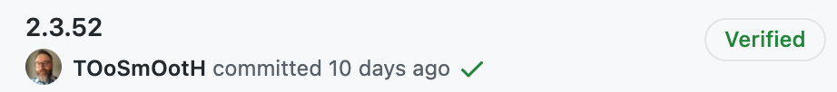

# Contributing to Security Onion

### Questions, suggestions, and general comments
* Security Onion uses GitHub's [Discussions](https://github.com/Security-Onion-Solutions/securityonion/discussions) to provide a forum where the community and developers can interact as well as ask and answer questions.

### Reporting a bug
* The primary place to report unexpected behavior or possible bugs is the repo's [Discussions forum](https://github.com/Security-Onion-Solutions/securityonion/discussions).

*  **If you are familiar with the current version of Security Onion and are confident you've discovered a bug**, first ensure there is not already an issue present by searching the open [issues](https://github.com/Security-Onion-Solutions/securityonion/issues). If there is, a thumbs up :+1: is a great way to show this bug is affecting you too.

* If an issue doesn't exist, [open a new one](https://github.com/Security-Onion-Solutions/securityonion/issues/new), following the directions in the issue template. This means including:
  * **System information** and how Security Onion was installed
  * **Log files** relevant to the bug report
  * **Reproduction steps** 

### Contributing code

* **All commits must be signed** with a valid key that has been added to your GitHub account. Each commit should have the "**Verified**" tag when viewed on GitHub as shown below:
  
  

* If an issue does not already exist for the bug or feature for which you are submitting a pull request, [create one](https://github.com/Security-Onion-Solutions/securityonion/issues/new) with the relevant prefix. (**`FIX:`** for bug fixes, **`FEATURE:`** for new features.)

* Link the PR to the related issue, either using [keywords](https://docs.github.com/en/issues/tracking-your-work-with-issues/creating-issues/linking-a-pull-request-to-an-issue#linking-a-pull-request-to-an-issue-using-a-keyword) in the PR description, or [manually](https://docs.github.com/en/issues/tracking-your-work-with-issues/creating-issues/linking-a-pull-request-to-an-issue#manually-linking-a-pull-request-to-an-issue).

* **Pull requests should be opened against the `dev` branch of this repo**, and should clearly describe the problem and solution.

* Be sure you have tested your changes and are confident they will not break other parts of the product.

* See this document's [code styling and conventions section](#code-style-and-conventions) below to be sure your PR fits our code requirements prior to submitting.

* Change behavior (fix a bug, add a new feature) separately from refactoring code. Refactor pull requests are welcome, but ensure your new code behaves exactly the same as the old.

* **Do not refactor code for non-functional reasons**. If you are submitting a pull request that refactors code, ensure the refactor is improving the functionality of the code you're refactoring (e.g. decreasing complexity, removing reliance on 3rd party tools, improving performance).

* Before submitting a PR with significant changes to the project, [start a discussion](https://github.com/Security-Onion-Solutions/securityonion/discussions/new) explaining what you hope to acheive. The project maintainers will provide feedback and determine whether your goal aligns with the project. 

### Code style and conventions
* **Keep code [DRY](https://en.wikipedia.org/wiki/Don%27t_repeat_yourself)**. For example, Bash code used by multiple scripts will likely best be added to [`so-common`](salt/common/tools/sbin/so-common).

* All new Bash code should pass [ShellCheck](https://www.shellcheck.net/) analysis. Where errors can be *safely* [ignored](https://github.com/koalaman/shellcheck/wiki/Ignore), the relevant disable directive should be accompanied by a brief explanation as to why the error is being ignored.

* **Ensure all YAML (this includes Salt states and pillars) is properly formatted**. The spec for YAML v1.2 can be found [here](https://yaml.org/spec/1.2/spec.html), however there are numerous online resources with simpler descriptions of its formatting rules. 

* **All code of any language should match the style of other code of that same language within the project.** Be sure that any changes you make do not break from the pre-existing style of Security Onion code.
