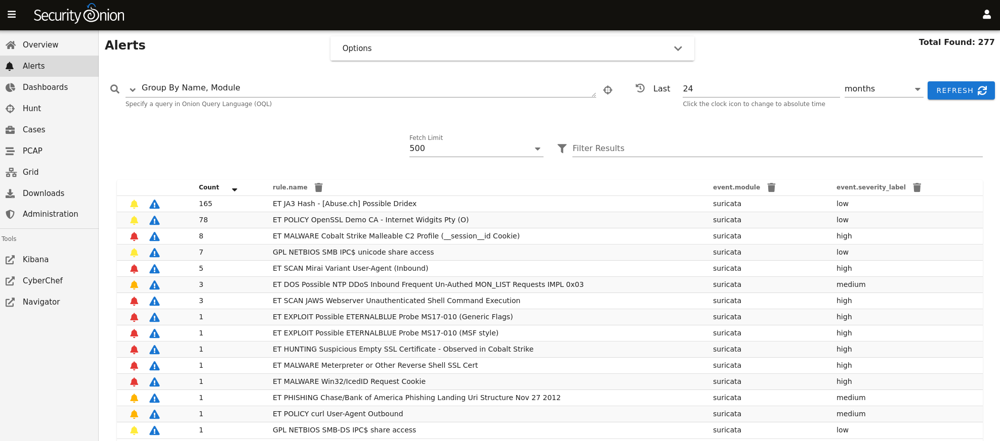
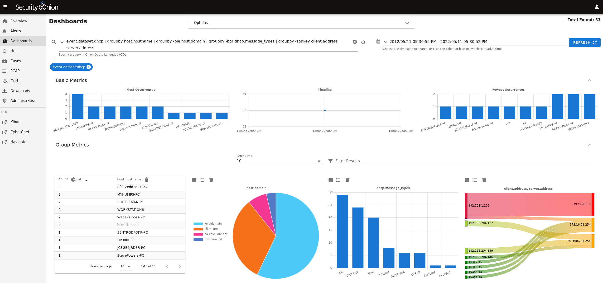
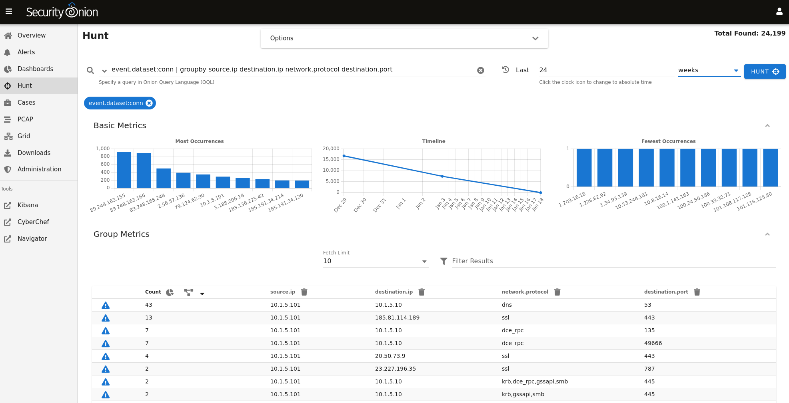
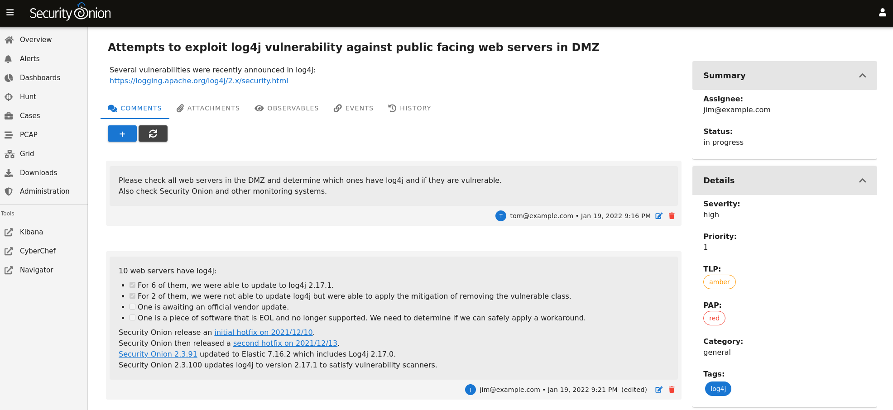

## Security Onion 2.3

Security Onion 2.3 is here!

## End Of Life Warning

Security Onion 2.3 reaches End Of Life (EOL) on April 6, 2024:

https://blog.securityonion.net/2023/10/6-month-eol-notice-for-security-onion-23.html

For new installations, please see the 2.4 branch of this repo:

https://github.com/Security-Onion-Solutions/securityonion/tree/2.4/main

If you have an existing 2.3 installation and would like to migrate to 2.4, please see:

https://docs.securityonion.net/en/2.4/appendix.html

## Screenshots

Alerts

Dashboards

Hunt

Cases

### Release Notes

https://docs.securityonion.net/en/2.3/release-notes.html

### Requirements

https://docs.securityonion.net/en/2.3/hardware.html

### Download

https://docs.securityonion.net/en/2.3/download.html

### Installation

https://docs.securityonion.net/en/2.3/installation.html

### FAQ

https://docs.securityonion.net/en/2.3/faq.html

### Feedback

https://docs.securityonion.net/en/2.3/community-support.html
